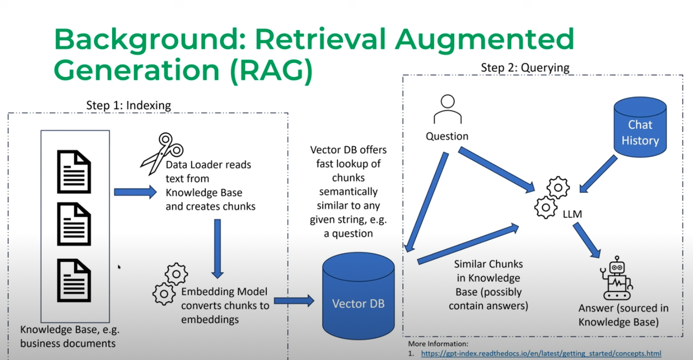

# Digikey-RAG
_Under Development_
Period project updates found [here](https://isabelanyc.github.io/projects/digikey/digikey-rag.html)

## Overview
The Digikey RAG project aims to leverage the power of LLMs for easier search and queries of electronics parts found on Digikey.

## RAG Overview

  

Diagram taken from [LlamaIndex webinar](https://www.youtube.com/watch?v=njzB6fm0U8g&t=904s)

## Features
- **Search Components**: Search for specific parts using the Digikey API (`test_api.py`).
- **Retrieve Datasheets**: Download datasheets for various components (`get_datasheets.py`).
- **Indexing**: Load and index PDFs for efficient search (`indexing.py`).
- **Querying**: Placeholder for future querying functionality (`querying.py`).
- **Demo**: A comment hinting at a potential future feature (`demo.py`).
- **PDF Processing**: `process.py` was created to process the PDF datasheets because using the PDF loader with langchain was becoming a pain. Datasheets have a lot of pictures and tables, and the document loaders options in langchain were causing a lot of trouble and were not good enough to parse the data. A workaround for now, with plans to find a good PDF loader later.

## Installation
1. Install the required packages listed in `requirements.txt`.
2. Set up environment variables for Digikey API credentials.

## Usage
- **Testing API**: Run `test_api.py` to test the Digikey API.
- **Get Datasheets**: Run `get_datasheets.py` to download datasheets.
- **Indexing**: Run `indexing.py` to load and index PDFs.
- **PDF Processing**: Run `process.py` to process PDFs as a temporary solution to the PDF loading issue.

## License
This project is licensed under the [MIT License](https://opensource.org/license/mit/).
